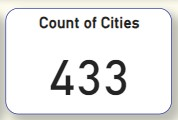
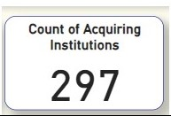
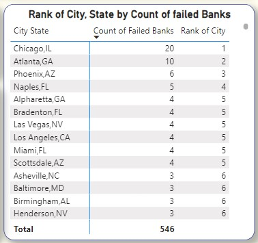

# Analysis on FDIC Failed Banks List (2000-2020)

## Introduction

The period from 2000 to 2020 witnessed significant upheaval in the banking industry, with several banks facing insolvency and failure. This report aims to provide a comprehensive analysis of these failed banks, focusing on lost funds by year, lost funds by banks, lost funds by city, count of failed by city, and the involvement of acquiring institutions. FDIC means Federal Deposit Insurance Corporation.

## Problem statement

Analysis of failed banks between 2000 and 2020, focusing on assessing the extent of lost funds by year and by banks.
Understanding the distribution of failed banks across different cities.
Examining the role of acquiring institutions in the aftermath of these failures.
Showing the sum of lost funds per city.

## The tool used for the analysis
Microsoft Power BI. The following Power BI features were incorporated;

- Skills/Concepts demonstrated,
- DAX,
- New Measures,
- Slicing,
- Data visualization,
- Drill Through,
- Data Aggregation,
- Report storytelling,
- Insight Generation,
- Interactivity.

  ## Data sourcing

The dataset was gotten from [here](https://catalog.data.gov/dataset/fdic-failed-bank-list)

## Modeling 
A calendar table was created in order to create a date hierarchy. A relationship was created between the banklist and calendar tables.

## Visualization

The dashboard report is below

You can interact with the dashboard [here](https://app.powerbi.com/view?r=eyJrIjoiNDk4YzFjOTYtYzE0ZC00ODNiLWJlM2MtMzNiYjIyZGZkNDVhIiwidCI6ImY1OWE1ZDBkLThmNDEtNGNhNS05MmE5LTI3MDM1ZjMwNDZiOCJ9)

## Analysis and Implications

### Total lost funds

### Count of Failed Banks

### Count of Cities

### Count of Acquiring Institutions

### Total Lost Funds by Year 

The highest lost funds ($1,608,622) were recorded in 2010 and the lowest ($9,291) was in 2000.

### Lost Funds by Bank

Examining individual banks' failures and their associated lost funds reveals key insights into the severity of each case. The First State Bank recorded the highest lost funds ($31,290), followed by Premier Bank ($31,243). The Bank of Honolulu recorded the lowest loss ($4,645).

### Lost funds by City, State

At $202,858, Chicago, IL recorded the highest lost funds followed by Atlanta, GA ($96,522) and city of Honolulu, HI had the least fund lost ($4,645).

### Count of Banks by Acquiring Institutions

The involvement of acquiring institutions in the aftermath of bank failures signifies efforts to stabilize the industry.
31 banks have No Acquirer, State Bank and Trust Company acquired 12 banks followed by First-Citizens Bank and Trust Company which acquired 11 banks.

### Count of failed Banks by City

Understanding the geographical distribution of failed banks is crucial in identifying patterns and potential risk areas. Chicago, IL had 20 failed banks which was the highest number, followed by Atlanta, GA (10 failed banks).

 
 

The data analysis reveals several trends and implications:

- The year 2010 witnessed the highest total lost funds, indicating a particularly challenging period for the banking sector.
- Banks in Chicago, IL, Atlanta, GA, Phoenix, AZ, and Naples, FL experienced a disproportionately high number of failures, suggesting potential vulnerabilities in those regions.
- Acquiring institutions such as State Bank and Trust Company, First-Citizens Bank and Trust Company, Ameris Bank, U.S Bank N.A played a significant role in mitigating the impact of failed banks, contributing to industry stability.

## Conclusion

The analysis of the FDIC failed banks list between 2000 and 2020 provides valuable insights into the financial landscape during this period. By examining lost funds by year, lost funds by banks, lost funds by city, the count of failed banks by city, and the role of acquiring institutions, this report sheds light on the challenges and strategies employed to address the failures. This information can guide future policies and decisions aimed at enhancing the resilience of the banking industry.

## Recommendations
The following recommendations can be made;

- Increase oversight and regulation of banks in regions with a high number of bank failures to ensure that they are operating in a safe and sound manner. 
- Provide support and resources to smaller community banks to help them compete with larger banks and reduce the risk of bank failures. 
- Monitor banks that have a history of bank failures and implement stricter regulations if necessary. 
- Encourage banks to adopt better risk management practices to minimize the risk of bank failures.

